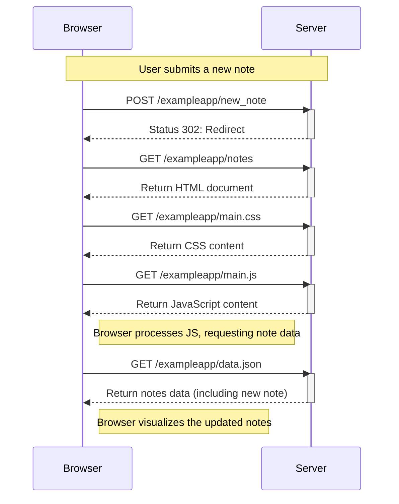

```mermaid
sequenceDiagram
    participant B as Browser
    participant S as Server

    Note over B,S: User submits a new note

    B->>S: POST /exampleapp/new_note
    activate S
    S-->>B: Status 302: Redirect
    deactivate S

    B->>S: GET /exampleapp/notes
    activate S
    S-->>B: Return HTML document
    deactivate S

    B->>S: GET /exampleapp/main.css
    activate S
    S-->>B: Return CSS content
    deactivate S

    B->>S: GET /exampleapp/main.js
    activate S
    S-->>B: Return JavaScript content
    deactivate S

    Note right of B: Browser processes JS, requesting note data

    B->>S: GET /exampleapp/data.json
    activate S
    S-->>B: Return notes data (including new note)
    deactivate S

    Note right of B: Browser visualizes the updated notes
```