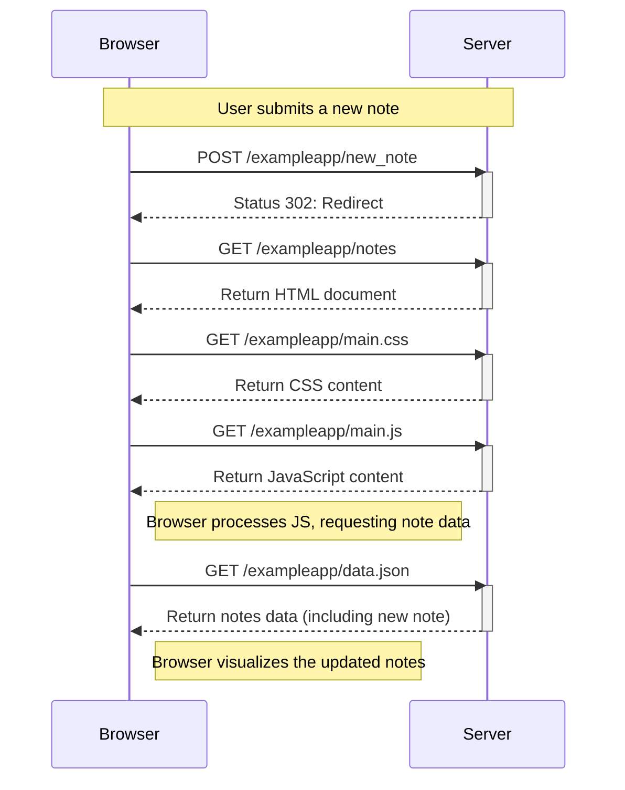

```mermaid
sequenceDiagram
    participant Browser
    participant Server

    Note over Browser,Server: User submits a new note

    Browser->>Server: POST /exampleapp/new_note
    activate Server
    Server-->>Browser: Status 302: Redirect
    deactivate Server

    Browser->>Server: GET /exampleapp/notes
    activate Server
    Server-->>Browser: Return HTML document
    deactivate Server

    Browser->>Server: GET /exampleapp/main.css
    activate Server
    Server-->>Browser: Return CSS content
    deactivate Server

    Browser->>Server: GET /exampleapp/main.js
    activate Server
    Server-->>Browser: Return JavaScript content
    deactivate Server

    Note right of Browser: Browser processes JS, requesting note data

    Browser->>Server: GET /exampleapp/data.json
    activate Server
    Server-->>Browser: Return notes data (including new note)
    deactivate Server

    Note right of Browser: Browser visualizes the updated notes
```