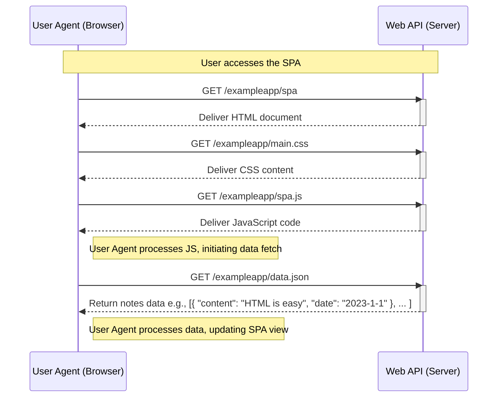

```mermaid
sequenceDiagram
    participant UserAgent as User Agent (Browser)
    participant WebAPI as Web API (Server)

    Note over UserAgent,WebAPI: User accesses the SPA

    UserAgent->>WebAPI: GET /exampleapp/spa
    activate WebAPI
    WebAPI-->>UserAgent: Deliver HTML document
    deactivate WebAPI

    UserAgent->>WebAPI: GET /exampleapp/main.css
    activate WebAPI
    WebAPI-->>UserAgent: Deliver CSS content
    deactivate WebAPI

    UserAgent->>WebAPI: GET /exampleapp/spa.js
    activate WebAPI
    WebAPI-->>UserAgent: Deliver JavaScript code
    deactivate WebAPI

    Note right of UserAgent: User Agent processes JS, initiating data fetch

    UserAgent->>WebAPI: GET /exampleapp/data.json
    activate WebAPI
    WebAPI-->>UserAgent: Return notes data e.g., [{ "content": "HTML is easy", "date": "2023-1-1" }, ... ]
    deactivate WebAPI

    Note right of UserAgent: User Agent processes data, updating SPA view
```